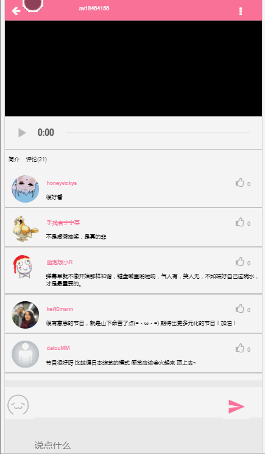

# mock-bilibili

> 

## 项目描述

### 技术架构

   * 用mint-ui和font-awesome
   * 使用了Vue.js+vuex+vue-router做单页应用


  
### 功能

  * 模仿的bilibili首页
  * 首页视频点入的详情页
  * 评论模块，不通过服务器，给页面添加评论
 
  
### 项目展示


### 在线预览


## Build Setup

``` bash
# install dependencies
npm install

# serve with hot reload at localhost:8080
npm run dev

# build for production with minification
npm run build

# build for production and view the bundle analyzer report
npm run build --report
```

